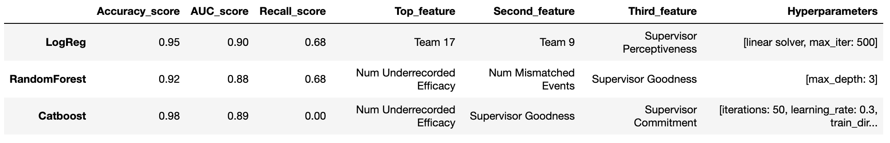

# Will My Employee Leave?

### Predicting Voluntary Employee Resignations

A classification model developed as part of a ficitional employee retention strategy to identify at-risk employees for leaving, based on appropriate features, to minimize real and sunk costs of replacement hire.

This project employed various data wrangling techniques to resolve messy data into a usable format for model prediction.

Three models were built including a Logistic Regression model, a Random Forest Classifier and a CatBoost Classifier.

## Problem Statement

It's estimated that losing an employee can cost a company 1.5-2x the employee’s salary. Depending on the individual’s level of seniority, the financial burden fluctuates. For hourly workers, it costs an average of $1,500 per employee, while for technical positions, the cost jumps to 100-150% of salary. Finally, at the high end, C-suite turnover can cost up to 213% of the employee’s salary.

Not only are you forced to dedicate time and resources to recruiting, onboarding and training a new hire after an employee leaves, but it’s estimated that two thirds of all sunk costs due to turnover are intangible, including lost productivity and knowledge, and internal strain on employees while the roles remain unfilled.

Being able to predict, and possibly minimize, employee turnover by identifying employees that may be at-risk for leaving voluntarily could help to reduce the cost of replacement hire due to turnover and increase employee retention. Specifically, the question I sought to answer was, "What contributing factors increase the likelihood of an employee leaving voluntarily?", and can we use those to determine when, and if, an employee might resign?

## Data

This synthetic dataset contains 18 months’ worth of daily performance and attrition data for a factory whose organizational structure comprises 508 workers. Due to employee turnover, a total of 687 persons appears in the dataset.

The dataset contained ~412,000 rows of data and 42 distinct features. Each record represents a type of event that occurred on a particular day in relation to a particular worker. It’s possible for a given worker to have more than one event (and row) for the same day.

The dataset’s observations cover both regular daily events (like workers’ attendance and daily level of Efficacy) and special one-time events (like accidents, an employee’s termination, or the onboarding of a new employee). A unique feature of the dataset is diverse causal relationships “hidden” within the data that are waiting to be uncovered through machine learning. See the supplemental information section in the Final_Report.pdf for more information on event types.

After some data wrangling and feature engineering, the dataset and problem statement were approached like a binary classification supervising learning problem, with a Resignation designated as the positive class, 1, and non-resignations designated as the negative class, 0.

Dataset: https://www.kaggle.com/datasets/gladdenme/factory-workers-daily-performance-attrition-s?resource=download

## Model Results



## Next Steps

Due to the models not being well-tuned, the results from these findings should be taken with a grain of salt. The next step in this endeavor would be to tune the parameters of these models to better optimize performance and achieve higher scores in the specific metrics.

In addition to this, seeing that the hidden traits from this dataset is not a realistic feature to obtain in the real world, perhaps incorporating data that may serve as a proxy for these trait scores may be useful such aptitude scores, or behavioral strengths.

Lastly, some more useful features that employees may actually care about such as commute time, salary, years employed and work-life balance may add even more value to the performance of the models, and significance of the results.

## Run Locally

This project was built using the miniconda virtual environment to manage project dependencies.

For more information on installing miniconda and setting up a virtual environment, go to [Miniconda](https://docs.conda.io/projects/miniconda/en/latest/).

Clone the project

```bash
  git clone https://github.com/kyleanthonyr/Predicting-Employee-Attrition/
```

Install dependencies

```bash
  conda install --file requirements.txt
```

## Acknowledgements

This project template was built using the [Cookie Cutter Data Science template](https://drivendata.github.io/cookiecutter-data-science/)

## Badges

[](https://choosealicense.com/licenses/mit/)

## Project Organization

    ├── LICENSE
    ├── README.md          <- The top-level README for developers using this project.
    ├── data
    │   ├── external       <- Data from third party sources.
    │   ├── interim        <- Intermediate data that has been transformed.
    │   ├── processed      <- The final, canonical data sets for modeling.
    │   └── raw            <- The original, immutable data dump.
    │
    ├── models             <- Trained and serialized models, model predictions, or model summaries
    │
    ├── notebooks          <- Jupyter notebooks. Naming convention is a number (for ordering),
    │                         the creator's initials, and a short `-` delimited description, e.g.
    │                         `1.0-jqp-initial-data-exploration`.
    │
    ├── reports            <- Generated analysis as HTML, PDF, LaTeX, etc.
    │   └── figures        <- Generated graphics and figures to be used in reporting
    │
    ├── requirements.txt   <- The requirements file for reproducing the analysis environment, e.g.
    │                         generated with `pip freeze > requirements.txt`
